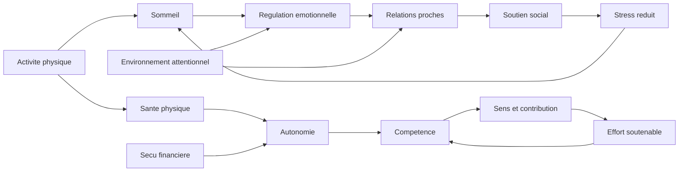

# Partie 8 — Ce qui compte vraiment : les 10 variables

Si l'objectif est de maximiser les chances d'une vie heureuse et satisfaisante sur plusieurs décennies, il faut prioriser les variables qui ont les meilleures propriétés systémiques : effet large, stabilité, interaction positive avec les autres domaines, contrôlabilité partielle et niveau de preuve suffisant.

## 8.1. Classement des 10 variables

| Rang | Variable | Justification | Interactions |
|---:|---|---|---|
| **1** | Relations proches fiables | Déterminant le plus transversal : soutien, santé, régulation, appartenance, sens. | Protège contre stress, maladie, chômage, vieillissement. |
| **2** | Sommeil et rythmes circadiens | Levier causal rapide sur humeur, cognition, impulsivité, santé. | Influence alimentation, activité, couple, travail. |
| **3** | Santé physique et mentale suivie | Condition de possibilité des autres domaines. | Douleur et troubles psychiques dégradent relations, travail, sommeil. |
| **4** | Activité physique régulière | Effet santé + humeur + sommeil + autonomie corporelle. | Améliore sommeil, cognition, estime réaliste. |
| **5** | Autonomie réelle | Besoin psychologique robuste ; réduit contrainte et résignation. | Dépend finances, travail, santé, relations. |
| **6** | Compétence et progression | Fournit efficacité, identité, employabilité, flow. | Nourrit travail, loisirs, confiance, sens. |
| **7** | Sens / contribution | Donne cohérence et tolérance à l'effort. | Transforme stress choisi en effort supportable. |
| **8** | Sécurité financière suffisante | Réduit stress matériel, augmente marge de choix. | Soutient autonomie, santé, logement, relation. |
| **9** | Régulation émotionnelle et cognitive | Réduit rumination, conflits, impulsivité, évitement. | Conditionne couple, travail, santé mentale. |
| **10** | Environnement attentionnel et social peu toxique | Moins de comparaison, interruption, isolement passif. | Protège sommeil, concentration, satisfaction. |

## 8.2. Justification détaillée du classement

### 1. Relations proches fiables

Les relations sont classées en premier parce qu'elles agissent simultanément sur :

- soutien émotionnel ;
- soutien matériel ;
- régulation physiologique du stress ;
- comportements de santé ;
- identité sociale ;
- sens ;
- protection pendant maladie, chômage, vieillissement et crises.

Le facteur décisif n'est pas le nombre de contacts mais la qualité : fiabilité, réciprocité, sécurité émotionnelle, capacité de réparation après conflit, présence dans les périodes difficiles.

### 2. Sommeil et rythmes circadiens

Le sommeil est prioritaire car il influence directement :

- humeur ;
- impulsivité ;
- mémoire ;
- prise de décision ;
- régulation émotionnelle ;
- inflammation ;
- santé métabolique ;
- tolérance au stress.

Il a un délai d'effet court. Une amélioration du sommeil peut produire des effets perceptibles en quelques jours ou semaines.

### 3. Santé physique et mentale suivie

La santé est une condition de possibilité : douleur, fatigue, anxiété, dépression, addiction, inflammation, troubles digestifs, troubles hormonaux ou maladie chronique peuvent absorber les ressources attentionnelles et émotionnelles.

La santé n'est pas entièrement contrôlable, mais elle est partiellement pilotable par dépistage, traitement, sommeil, activité physique, alimentation, réduction des substances délétères et accès aux soins.

### 4. Activité physique régulière

L'activité physique est un levier à rendement multiple :

- amélioration de l'humeur ;
- réduction de l'anxiété et de la détresse ;
- meilleure qualité de sommeil ;
- amélioration cardiovasculaire et métabolique ;
- autonomie corporelle ;
- sentiment de compétence ;
- prévention du déclin fonctionnel.

Elle doit être soutenable. Le modèle minimal est plus efficace qu'un protocole héroïque non maintenu.

### 5. Autonomie réelle

L'autonomie ne signifie pas absence de contraintes. Elle signifie disposer d'une marge de décision réelle et agir avec un sentiment de volition. Le manque d'autonomie chronique produit résignation, stress, cynisme et perte de motivation intrinsèque.

Domaines d'autonomie :

- horaires ;
- choix professionnels ;
- finances ;
- relations ;
- lieu de vie ;
- organisation domestique ;
- usage du temps ;
- environnement numérique.

### 6. Compétence et progression

Le sentiment de compétence produit efficacité, confiance réaliste, employabilité, identité et plaisir d'apprendre. Il protège contre l'impuissance apprise et soutient la motivation intrinsèque.

Le progrès doit être mesurable et gradué. Une exigence excessive transforme la compétence en perfectionnisme, puis en stress.

### 7. Sens / contribution

Le sens organise les efforts dans le temps. Il donne une cohérence aux contraintes et réduit le sentiment de vide ou d'absurdité. Il ne remplace pas sommeil, santé ou relations, mais il augmente la tolérance à l'effort choisi.

Sources de sens fréquentes :

- relations ;
- transmission ;
- travail utile ;
- création ;
- soin ;
- engagement civique ;
- spiritualité ou philosophie ;
- apprentissage ;
- contribution à un collectif.

### 8. Sécurité financière suffisante

L'argent est classé huitième, non parce qu'il est secondaire, mais parce que son effet dépend fortement du niveau de départ. Aux bas revenus, il est un levier majeur. Une fois les besoins matériels assurés, son rendement marginal diminue.

La sécurité financière utile inclut :

- absence de dette toxique ;
- logement stable ;
- accès aux soins ;
- alimentation correcte ;
- capacité à faire face aux imprévus ;
- marge de choix professionnel ;
- temps libéré quand c'est possible.

### 9. Régulation émotionnelle et cognitive

La régulation émotionnelle conditionne les autres variables. Une mauvaise régulation augmente conflits, évitement, impulsivité, consommation de compensation, procrastination et rumination.

Compétences centrales :

- identification émotionnelle ;
- réévaluation cognitive ;
- résolution de problème ;
- tolérance à l'inconfort ;
- demande de soutien ;
- capacité de réparation relationnelle ;
- distinction faits/interprétations.

### 10. Environnement attentionnel et social peu toxique

L'attention est une ressource limitée. Les environnements saturés d'interruptions, de comparaison sociale, de conflits ou de sollicitations commerciales dégradent le bien-être par accumulation.

Exemples d'expositions toxiques :

- notifications permanentes ;
- réseaux sociaux comparatifs ;
- information anxiogène sans action possible ;
- environnement conflictuel ;
- sommeil perturbé par écrans ;
- surcharge de choix ;
- pression statutaire.

## 8.3. Interactions principales

### Sommeil → régulation émotionnelle → relations

Un mauvais sommeil augmente irritabilité, réactivité émotionnelle, impulsivité et conflits. Les conflits dégradent ensuite le sommeil. Il faut donc traiter le sommeil comme un levier relationnel indirect.

### Argent → autonomie → stress

L'argent protège surtout lorsqu'il augmente les options réelles : choix du logement, accès aux soins, réduction de dette, possibilité de refuser certaines contraintes, marge face aux imprévus.

### Relations → santé → longévité

Le soutien social favorise comportements de santé, baisse du stress, meilleure récupération et meilleure adhérence aux traitements. L'effet est probablement bidirectionnel : les personnes en meilleure santé entretiennent aussi plus facilement leurs relations.

### Activité physique → sommeil → humeur

L'activité physique améliore la qualité du sommeil et l'énergie, ce qui facilite la régulation émotionnelle et l'activité sociale. Le bénéfice est souvent progressif.

### Sens → effort → compétence

Le sens augmente la tolérance à l'effort, et l'effort choisi développe la compétence. Mais sans récupération, le sens peut devenir justification du surmenage.

### Numérique → comparaison → satisfaction

La comparaison sociale transforme des conditions objectivement correctes en insatisfaction subjective. Elle augmente le désir de statut et réduit l'attention disponible pour les relations réelles.

## 8.4. Modèle d'interaction simplifié

## 8.5. Si une seule variable doit être améliorée

La meilleure variable dépend du profil :

| Profil dominant | Variable prioritaire | Pourquoi |
|---|---|---|
| Fatigue, irritabilité, faible énergie | Sommeil | Effet transversal rapide. |
| Isolement, peu de soutien | Relations fiables | Facteur protecteur majeur. |
| Sédentarité, humeur basse | Activité physique | Effet santé + humeur + sommeil. |
| Stress matériel | Sécurité financière | Réduit vigilance et contrainte. |
| Travail subi | Autonomie | Réduit contrainte chronique. |
| Vide subjectif | Sens/contribution | Organise les efforts. |
| Rumination, conflits | Régulation émotionnelle | Diminue boucles négatives. |
| Comparaison et distraction | Environnement attentionnel | Libère attention et satisfaction. |

## 8.6. Conclusion opérationnelle

Ces dix variables ne sont pas indépendantes. Elles forment un système. Le meilleur choix d'action est celui qui améliore simultanément plusieurs variables ou casse une boucle négative majeure. Dans la majorité des cas, les premières corrections devraient concerner sommeil, relations, activité physique, exposition numérique et stress matériel.
