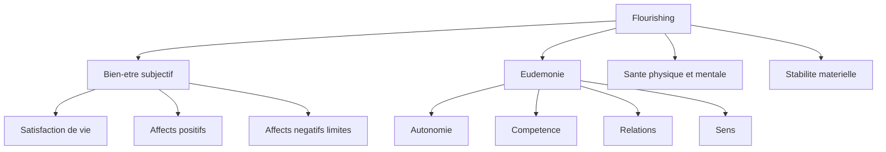
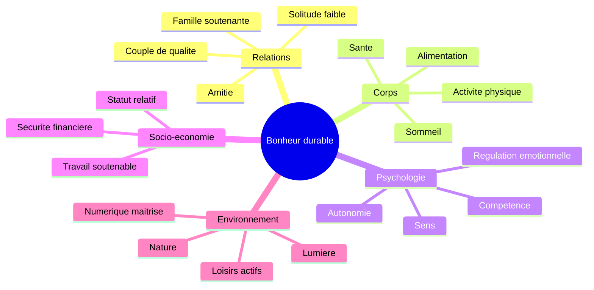
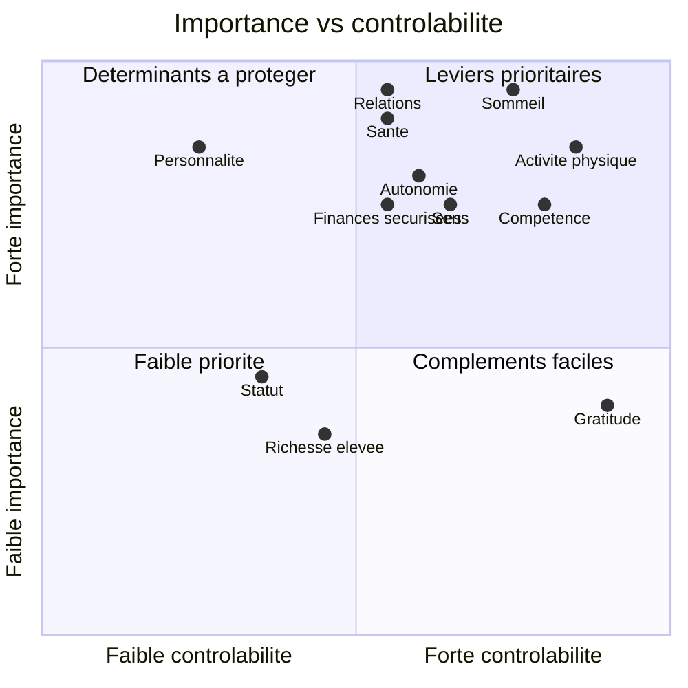
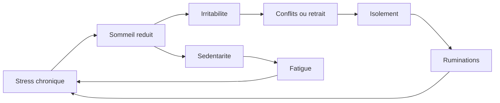
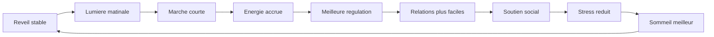
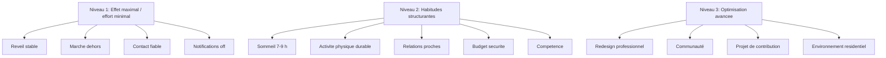
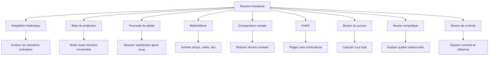
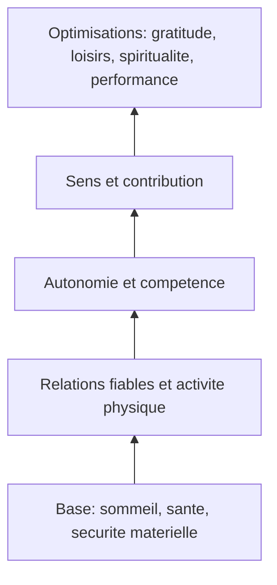

# Infographies et visualisations proposées

Ce fichier propose des supports visuels exploitables dans GitHub. Les diagrammes Mermaid sont rendus directement par GitHub dans les fichiers Markdown compatibles.

## 1. Architecture générale du bien-être

**Usage** : expliquer que le bonheur scientifique n'est pas une émotion unique.

## 2. Carte des déterminants majeurs

**Usage** : support d'introduction pour présenter la logique systémique.

## 3. Matrice importance / contrôlabilité

| Facteur | Importance | Contrôlabilité | Priorité |
|---|---:|---:|---|
| Sommeil | Très élevée | Moyenne à élevée | Haute |
| Relations proches | Très élevée | Moyenne | Haute |
| Activité physique | Élevée | Élevée | Haute |
| Santé physique | Très élevée | Moyenne | Haute |
| Autonomie | Élevée | Moyenne | Haute |
| Compétence | Élevée | Élevée | Haute |
| Sens | Élevée | Moyenne | Haute |
| Sécurité financière | Élevée si précarité | Moyenne | Variable mais forte si stress financier |
| Personnalité | Très élevée | Faible à moyenne | Indirecte |
| Statut social | Modérée | Faible à moyenne | Faible si coût élevé |
| Richesse élevée | Faible à modérée après sécurité | Moyenne | Faible à modérée |
| Gratitude | Faible à modérée | Élevée | Complément |

## 4. Boucle négative typique

**Message clé** : il faut casser la boucle au point le moins coûteux : sommeil, marche, réduction numérique, contact fiable ou charge de travail.

## 5. Boucle positive réaliste

## 6. Hiérarchie des interventions

## 7. Carte des illusions humaines

## 8. Infographie proposée : les 10 variables sur plusieurs décennies

Format recommandé : roue ou radar à 10 axes.

Axes :

1. relations proches fiables ;
2. sommeil ;
3. santé ;
4. activité physique ;
5. autonomie ;
6. compétence ;
7. sens ;
8. sécurité financière ;
9. régulation émotionnelle ;
10. environnement attentionnel.

Notation : 0 à 4, issue du questionnaire.

## 9. Infographie proposée : pyramide des priorités

Lecture : les optimisations supérieures sont moins rentables si la base est dégradée.

## 10. Graphique recommandé pour présentation

Créer un graphique en barres horizontales avec quatre colonnes qualitatives :

- importance ;
- niveau de preuve ;
- contrôlabilité ;
- délai d'effet.

Données proposées :

| Variable | Importance | Preuve | Contrôlabilité | Délai d'effet |
|---|---:|---:|---:|---:|
| Sommeil | 5 | 5 | 4 | 5 |
| Relations | 5 | 4 | 3 | 3 |
| Activité physique | 5 | 5 | 4 | 4 |
| Santé | 5 | 4 | 3 | 3 |
| Autonomie | 4 | 4 | 3 | 3 |
| Compétence | 4 | 4 | 4 | 3 |
| Sens | 4 | 3 | 3 | 2 |
| Finances | 4 | 4 | 3 | 2 |
| Numérique | 3 | 3 | 4 | 5 |
| Gratitude | 2 | 4 | 5 | 4 |

## 11. Message visuel central

Le message à mettre en avant dans tout support graphique :

> Le bonheur durable n'est pas maximisé par une émotion unique, mais par la réduction des expositions toxiques et le renforcement répété des facteurs protecteurs.
