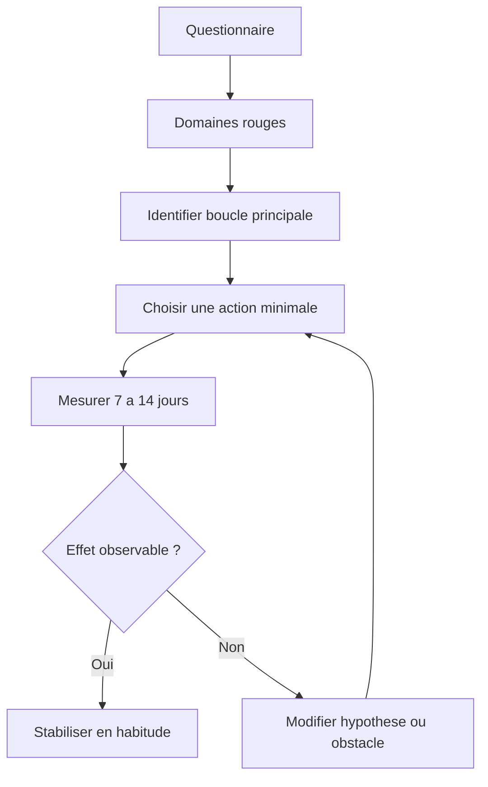

# Matrice opérationnelle des actions

Cette matrice classe les actions selon leur bénéfice attendu, leur niveau de preuve, leur difficulté, leur délai d'effet et leurs limites. Elle complète le questionnaire et le tableau de bord.

## 1. Lecture de la matrice

| Critère | Interprétation |
|---|---|
| **Bénéfice attendu** | Domaine principal amélioré : humeur, satisfaction, santé, relations, autonomie, compétence, sens ou sécurité. |
| **Preuve** | A à D selon l'échelle du guide. |
| **Difficulté** | Faible, modérée, élevée. |
| **Délai d'effet** | Immédiat, jours, semaines, mois, années. |
| **Limites** | Conditions où l'action peut être insuffisante ou contre-productive. |

## 2. Actions à rendement élevé et effort faible

| Action | Bénéfice attendu | Preuve | Difficulté | Délai | Limites |
|---|---|---|---|---|---|
| Heure de réveil stable | Sommeil, humeur, énergie, régulation émotionnelle. | A | Modérée | 1–2 semaines | Difficile avec horaires atypiques ou obligations familiales. |
| Marche 10–20 min dehors | Activité physique, lumière, humeur, attention. | B | Faible | Jour-semaine | Adapter à la douleur, météo et sécurité. |
| Notifications non nécessaires désactivées | Attention, réduction FoMO et comparaison. | C | Faible | Immédiat | À adapter aux obligations réelles. |
| Contact direct avec une personne fiable | Soutien social, baisse isolement, régulation émotionnelle. | B | Faible à modérée | Jours | Relation conflictuelle ou asymétrique. |
| Gratitude écrite 2–3 fois/semaine | Réorientation attentionnelle, satisfaction modeste. | A | Faible | Jours-semaines | Habituation ; effet faible si mécanique. |
| Action prosociale concrète | Connexion, utilité, affect positif. | A-B | Faible | Immédiat | Ne doit pas devenir surcharge. |
| Audit de comparaison sociale | Réduction envie, insatisfaction, bruit attentionnel. | B-C | Faible | Jours | Effet dépend de l'usage réel. |
| Loisir actif planifié | Récupération, plaisir, flow, relation. | B | Faible à modérée | Semaine | Moins utile si vécu comme performance imposée. |

## 3. Habitudes structurantes

| Habitude | Bénéfice attendu | Preuve | Difficulté | Délai | Limites |
|---|---|---|---|---|---|
| Sommeil 7–9 h avec rythme stable | Santé mentale, cognition, stress, santé physique. | A | Modérée | 2–6 semaines | Si difficulté persistante, évaluation spécialisée. |
| 150 min/semaine d'activité aérobie | Humeur, anxiété, santé cardiovasculaire, sommeil. | A | Modérée | 2–12 semaines | Adapter aux capacités et pathologies. |
| Renforcement 2×/semaine | Autonomie corporelle, santé, compétence. | B | Modérée | Mois | Progression graduelle nécessaire. |
| Entretien de 3–5 relations proches | Soutien, appartenance, protection long terme. | B | Modérée | Mois-années | Demande temps, réciprocité, réparation. |
| Budget de sécurité | Réduction stress matériel, autonomie. | B | Modérée | Mois | Revenus insuffisants limitent la marge. |
| Alimentation peu transformée ou méditerranéenne | Santé globale, énergie, humeur indirecte. | B-C | Modérée | Semaines-mois | Effet psychique moins direct. |
| Loisir actif régulier | Récupération, identité, flow. | B | Modérée | Semaines | Effets faibles si loisir surtout passif. |
| Compétence suivie par micro-progrès | Maîtrise, identité, employabilité, flow. | B | Modérée | Mois | Risque de perfectionnisme. |
| Réduction structurée des conflits | Sommeil, stress, qualité relationnelle. | B | Modérée à élevée | Semaines-mois | Nécessite coopération. |
| Pratique de régulation émotionnelle | Moins de rumination, moins de conflits. | A-B | Modérée | Semaines-mois | À adapter au profil. |

## 4. Optimisation avancée

| Action avancée | Bénéfice attendu | Preuve | Difficulté | Délai | Limites |
|---|---|---|---|---|---|
| Redesign professionnel | Autonomie, compétence, sens, stress. | B | Élevée | Mois-années | Contraintes économiques et marché du travail. |
| Construction communautaire | Appartenance, soutien, contribution. | B-C | Élevée | Mois-années | Qualité du groupe déterminante. |
| Projet de contribution long terme | Sens, identité, relations, compétence. | B-C | Élevée | Mois-années | Peut devenir surcharge. |
| Aménagement résidentiel | Sommeil, nature, sécurité, relations, transport. | B-C | Élevée | Mois-années | Coût, contraintes familiales, accès. |
| Accompagnement psychologique ou relationnel | Régulation, conflits, schémas répétitifs. | A-B selon indication | Élevée | Mois | Dépend de l'alliance et de l'indication. |
| Périodisation récupération/stress | Prévention de surcharge, énergie durable. | B | Modérée | Semaines-mois | Nécessite suivi réel. |
| Maîtrise d'une compétence difficile | Flow, compétence, identité, autonomie. | B | Élevée | Mois-années | Risque de sacrifice relationnel. |

## 5. Matrice effet / effort

| Catégorie | Actions typiques | Commentaire |
|---|---|---|
| **Effet élevé / effort faible** | marche courte, réveil stable, notifications off, contact fiable | Point d'entrée recommandé. |
| **Effet élevé / effort élevé** | redesign professionnel, communauté, activité physique durable | À planifier après stabilisation des bases. |
| **Effet modéré / effort faible** | gratitude, respiration, loisir actif simple, audit numérique | Bon complément, ne remplace pas les bases. |
| **Effet faible / effort élevé** | quête de statut, optimisation matérielle au-delà de la sécurité, productivité excessive | Souvent surestimé. |

## 6. Algorithme de sélection d'action

1. Remplir le questionnaire.
2. Identifier les domaines rouges.
3. Parmi les rouges, choisir celui qui dégrade le plus d'autres domaines.
4. Sélectionner une action de niveau 1 liée à ce domaine.
5. Définir un indicateur mesurable sur 7 jours.
6. Réévaluer après 2 à 4 semaines.
7. Ajouter seulement ensuite une habitude structurante.

## 7. Exemples de décisions

### Profil A — Sommeil rouge, activité rouge, numérique rouge

Priorité : sommeil et numérique.

Actions : réveil stable, téléphone hors chambre, marche matinale 10 minutes, notifications réduites.

Indicateurs : nuits réparatrices, heure de réveil, humeur moyenne, temps d'écran subi.

### Profil B — Relations rouges, travail orange, sens bas

Priorité : relations.

Actions : deux contacts directs par semaine, activité sociale simple, clarification d'une contribution concrète, réduction du temps numérique passif.

Indicateurs : contacts significatifs, humeur après contact, sentiment d'appartenance.

### Profil C — Finances rouges, autonomie basse

Priorité : sécurité matérielle.

Actions : budget simple, liste des charges fixes, plan dettes coûteuses, une négociation ou suppression de charge.

Indicateurs : stress financier 0–10, marge mensuelle, nombre de décisions financières clarifiées.

## 8. Actions surestimées à surveiller

| Action surestimée | Problème | Alternative plus robuste |
|---|---|---|
| Changer tout son mode de vie en une semaine | Non soutenable. | Une action minimale mesurée. |
| Chercher plus de motivation | Variable instable. | Réduire la friction environnementale. |
| Acheter un objet pour améliorer durablement l'humeur | Adaptation rapide. | Acheter du temps, de la santé ou du lien. |
| Accumuler les objectifs de productivité | Coûts cachés sur sommeil et relations. | Prioriser compétence et récupération. |
| Multiplier les contacts superficiels | Peu protecteur. | Entretenir quelques relations fiables. |
| Optimisation neurochimique vague | Modèle trop simplifié. | Agir sur sommeil, activité, relation et stress. |

## 9. Conclusion

La matrice recommande une stratégie séquentielle : corriger les domaines rouges, consolider les habitudes structurantes, puis optimiser les domaines avancés. Les actions à meilleur rendement sont généralement simples, répétées et systémiques plutôt que spectaculaires.
