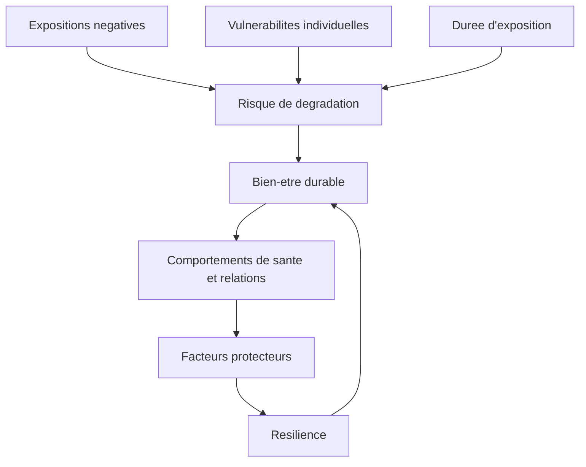
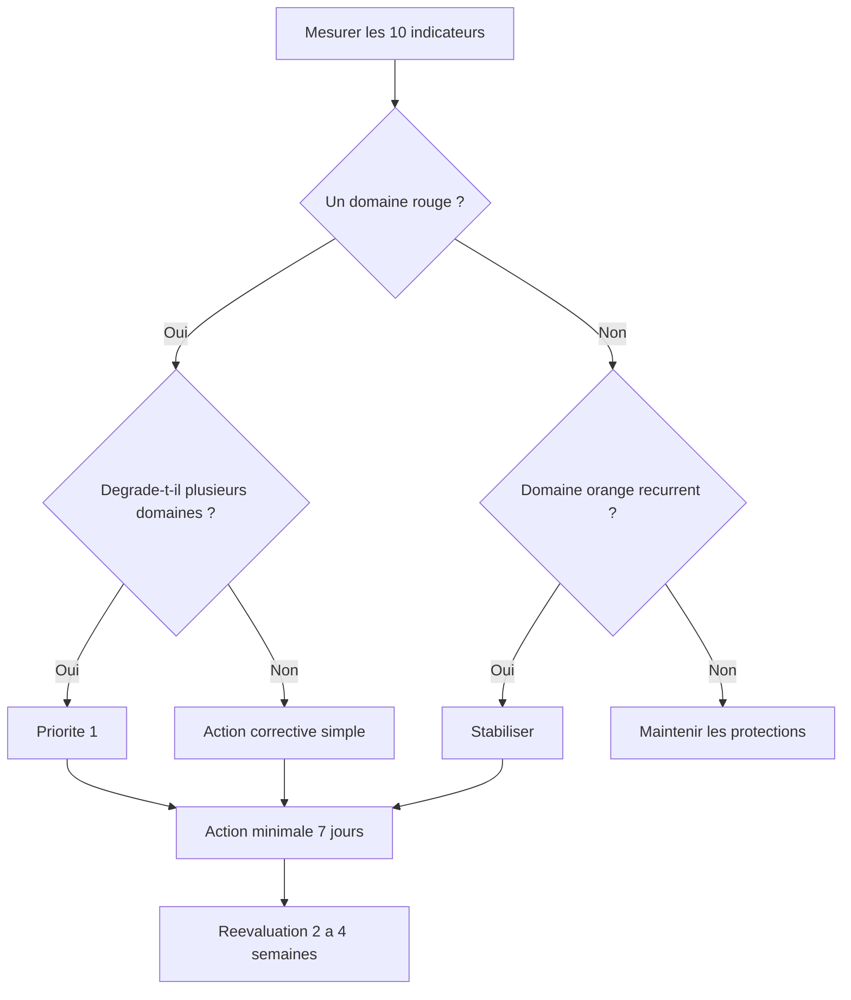

# Tableau de bord — Gestion des risques du bonheur

Ce tableau de bord transforme les déterminants du bien-être en indicateurs suivables. Il ne vise pas à produire un score unique de bonheur, mais à repérer les expositions négatives, les facteurs protecteurs et les boucles de dérive.

## 1. Principe général

Le bonheur durable est traité comme un système :

La logique est comparable à la gestion des risques :

- identifier les dangers ;
- évaluer l'exposition ;
- détecter les signaux précoces ;
- renforcer les barrières protectrices ;
- suivre les indicateurs retardés ;
- corriger les dérives avant qu'elles deviennent structurelles.

## 2. Indicateurs hebdomadaires

| Domaine | Indicateur hebdomadaire | Vert | Orange | Rouge | Action corrective |
|---|---:|---:|---:|---:|---|
| Sommeil | Nuits réparatrices ou ≥ 7 h | 5–7/7 | 3–4/7 | 0–2/7 | Heure de réveil fixe, lumière matin, routine soir, réduire écrans tardifs. |
| Relations | Contacts significatifs | ≥ 3/semaine | 1–2/semaine | 0 | Programmer appel, repas, marche, message direct, aide donnée ou reçue. |
| Activité physique | Minutes modérées | ≥ 150/semaine | 60–149 | < 60 | Marche quotidienne, reprise graduelle, renforcement 2×/semaine. |
| Travail | Autonomie perçue 0–10 | ≥ 7 | 4–6 | ≤ 3 | Négocier marge de décision, clarifier priorités, réduire tâches toxiques. |
| Compétence | Micro-progrès mesurables | ≥ 3/semaine | 1–2 | 0 | Objectif de maîtrise, feedback, formation ciblée. |
| Sens | Alignement valeurs 0–10 | ≥ 7 | 4–6 | ≤ 3 | Identifier contribution réelle, supprimer engagements incohérents. |
| Stress | Tension moyenne 0–10 | ≤ 4 | 5–6 | ≥ 7 | Récupération planifiée, réduction charge, soutien, aide compétente si persistant. |
| Numérique | Usage subi/comparatif | Faible | Modéré | Élevé | Notifications off, plages sans téléphone, audit des comptes suivis. |
| Finances | Stress financier 0–10 | ≤ 3 | 4–6 | ≥ 7 | Budget, dettes coûteuses, épargne de sécurité, conseil spécialisé. |
| Santé | Douleur/fatigue 0–10 | ≤ 3 | 4–6 | ≥ 7 | Consultation, sommeil, activité adaptée, traitement cause. |

## 3. Formulaire hebdomadaire minimal

| Question | Réponse |
|---|---|
| Score satisfaction de vie 0–10 |  |
| Humeur moyenne 0–10 |  |
| Stress moyen 0–10 |  |
| Nuits réparatrices cette semaine |  |
| Minutes d'activité physique |  |
| Contacts sociaux significatifs |  |
| Autonomie moyenne 0–10 |  |
| Progrès ou compétence 0–10 |  |
| Sens ou alignement 0–10 |  |
| Stress financier 0–10 |  |
| Exposition numérique subie 0–10 |  |
| Domaine rouge principal |  |
| Action corrective choisie |  |
| Date de réévaluation |  |

## 4. Matrice d'interprétation

| Situation observée | Hypothèse opérationnelle | Action de première intention |
|---|---|---|
| Sommeil rouge + irritabilité + conflits | La dérégulation émotionnelle est probablement alimentée par le manque de récupération. | Stabiliser réveil, réduire stimulation tardive, marche matinale. |
| Relations rouges + humeur basse | L'isolement réduit le soutien et augmente la rumination. | Programmer 2 contacts directs, activité sociale simple. |
| Activité rouge + fatigue haute | Boucle sédentarité-fatigue-humeur possible. | Reprise très graduelle, marche 10 min, objectif de régularité. |
| Autonomie rouge + stress haut | Contrainte chronique ou marge de décision insuffisante. | Identifier une contrainte modifiable, négocier une marge, réduire charge. |
| Finances rouges + anxiété matérielle | Stress de sécurité dominant. | Budget, dettes coûteuses, épargne de sécurité, aides disponibles. |
| Numérique rouge + comparaison | Exposition attentionnelle toxique. | Notifications off, plages sans téléphone, audit comptes et contenus. |
| Sens rouge + compétence basse | Efforts non reliés à une direction claire. | Clarifier valeurs, choisir un micro-projet de contribution. |
| Santé rouge + plusieurs domaines dégradés | Facteur corporel ou psychique central. | Évaluation compétente, adaptation charge, sommeil et activité douce. |

## 5. Gestion des seuils

### Règle 1 — Un rouge durable prime sur une optimisation secondaire

Si un domaine reste rouge plus de deux semaines, il doit être traité avant les actions avancées. Exemple : chercher plus de sens ou plus de productivité sans corriger un sommeil rouge est rarement rentable.

### Règle 2 — Les domaines verts sont des actifs à protéger

Une relation fiable, un rythme de sommeil stable ou une activité physique maintenue ne doivent pas être sacrifiés pour un gain de statut ou de revenu mal évalué.

### Règle 3 — Les indicateurs précoces comptent plus que les indicateurs tardifs

Les indicateurs tardifs comme satisfaction de vie, performance ou état de santé global réagissent lentement. Les indicateurs précoces — sommeil, irritabilité, retrait social, surcharge numérique, fatigue — permettent d'agir plus tôt.

## 6. Audit mensuel

| Question mensuelle | Réponse |
|---|---|
| Quel domaine a le plus souvent été rouge ? |  |
| Quel domaine a le plus souvent été vert ? |  |
| Quelle action a produit un effet mesurable ? |  |
| Quelle action a échoué par manque de friction réduite ? |  |
| Quel facteur protecteur est menacé ? |  |
| Quelle exposition négative est devenue chronique ? |  |
| Quelle décision doit être prise le mois prochain ? |  |

## 7. Diagramme de priorisation

## 8. Sortie opérationnelle recommandée

À la fin de chaque semaine :

- domaine prioritaire : ________
- hypothèse causale : ________
- action minimale : ________
- indicateur suivi : ________
- seuil de réussite : ________
- obstacle attendu : ________
- correction prévue : ________

## 9. Limites

- Le tableau de bord ne remplace pas une évaluation clinique ou sociale lorsqu'une difficulté dépasse les marges individuelles.
- Les scores subjectifs sont utiles pour le suivi intra-individuel, moins pour comparer des personnes.
- Une amélioration d'indicateur ne prouve pas toujours une causalité ; elle indique une piste d'action.
- Les seuils proposés sont pragmatiques, non diagnostiques.
